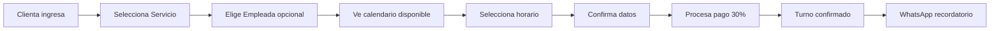

# 💅 Lia Nails - Sistema de Gestión de Salón de Belleza

<div align="center">
  


**Sistema completo para gestión de turnos, servicios y empleadas en salones de belleza especializados en uñas, pies y pestañas.**

</div>

## 📋 Descripción del Proyecto

**Lia Nails** es una aplicación web completa para la gestión integral de un salón de belleza especializado en:
- 💅 **Servicios de uñas** (esmaltado tradicional, semipermanente, nail art)
- 🦶 **Tratamientos de pies** (pedicura, belleza podal)  
- 👁️ **Extensión de pestañas** (pelo a pelo, volumen ruso)

### 🎯 Objetivos del Sistema
- **Para Clientas**: Reserva de turnos online, selección de empleadas, pagos digitales
- **Para Empleadas**: Gestión de agenda personal, servicios asignados, historial de clientas
- **Para Administradores**: Control total del negocio, reportes, configuración

## 🏗️ Arquitectura Técnica

### **Backend - NestJS + PostgreSQL**
```
📁 lia-nails-backend/
├── 🔐 src/auth/           # Autenticación JWT
├── 📊 src/entities/       # 9 Entidades TypeORM
├── 🏢 src/modules/
│   ├── empleadas/         # CRUD Empleadas ✅
│   ├── servicios/         # CRUD Servicios ✅  
│   ├── clientas/          # CRUD Clientas (próximo)
│   ├── turnos/            # Sistema Reservas (próximo)
│   └── pagos/             # Procesamiento Pagos (próximo)
└── 📖 /api               # Swagger Documentation
```

### **Tecnologías Implementadas**
- **NestJS 10.x** - Framework backend profesional
- **TypeScript** - Tipado estricto (0% `any`)
- **PostgreSQL** - Base de datos relacional
- **TypeORM** - ORM con migraciones
- **JWT** - Autenticación segura
- **Swagger** - Documentación automática de API
- **Class-validator** - Validaciones robustas en DTOs

## 🗄️ Modelo de Base de Datos

### **Entidades Principales (9 tablas)**

```sql
🧑‍💼 usuarios           # Sistema de autenticación
├── 👩‍💼 empleadas         # Staff del salón
├── 💅 servicios         # Catálogo de servicios
├── 🔗 servicio_empleada # Relación M:M servicios-empleadas
├── 👩 clientas          # Base de datos de clientas
├── 📅 turnos            # Sistema de reservas
├── 💳 pagos             # Transacciones y comprobantes
├── 📝 observaciones_clienta # Historial y preferencias
└── 🚫 bloqueos_horario  # Disponibilidad empleadas
```

### **Relaciones Clave**
- **Empleada → Servicios**: Una empleada puede ofrecer múltiples servicios
- **Clienta → Turnos**: Historial completo de reservas
- **Turno → Empleada + Servicio**: Cada turno asigna empleada específica
- **Turno → Pago**: Control de facturación y anticipos

## 🚀 Estado Actual del Desarrollo

### ✅ **Completado**
- **Autenticación completa** con JWT y guards
- **Módulo Empleadas** con CRUD completo
- **Módulo Servicios** con categorías y precios
- **Base de datos** con todas las entidades y relaciones
- **Documentación Swagger** en `/api`
- **Tipado TypeScript** estricto (sin `any`)
- **Validaciones robustas** con DTOs en español
- **Sistema de soft delete** para datos históricos

### 🔄 **En Desarrollo**
- **Módulo Clientas** - Sistema de búsqueda y observaciones
- **Módulo Turnos** - Core del sistema de reservas
- **Módulo Pagos** - Integración con gateways argentinos
- **Sistema de Roles** - Permisos admin vs empleada

### 📋 **Próximos Features**
- **WhatsApp API** - Recordatorios automáticos
- **MercadoPago Integration** - Pagos online
- **Panel Admin** - Dashboard con métricas
- **App PWA** - Aplicación móvil progresiva

## 🔧 Instalación y Configuración

### **Requisitos Previos**
```bash
Node.js >= 18.x
PostgreSQL >= 15.x
npm >= 9.x
```

### **Configuración del Proyecto**
```bash
# 1. Clonar el repositorio
git clone https://github.com/lessslie/Lia-Nails.git
cd lia-nails-backend

# 2. Instalar dependencias
npm install

# 3. Configurar variables de entorno
cp .env.example .env
# Editar .env con tus credenciales de PostgreSQL

# 4. Ejecutar migraciones
npm run typeorm:run

# 5. Cargar datos iniciales (opcional)
npm run seed

# 6. Levantar el servidor de desarrollo
npm run start:dev
```

### **Variables de Entorno (.env)**
```env
# Database
DATABASE_HOST=localhost
DATABASE_PORT=5432
DATABASE_USERNAME=tu_usuario
DATABASE_PASSWORD=tu_password
DATABASE_NAME=lia_nails

# JWT
JWT_SECRET=tu_jwt_secret_super_seguro
JWT_EXPIRES_IN=24h

# Server
PORT=3000
NODE_ENV=development
```

## 📖 Documentación de la API

### **Swagger UI**
Una vez levantado el servidor, acceder a:
```
http://localhost:3000/api
```

### **Endpoints Principales Disponibles**

#### 🔐 **Autenticación**
```typescript
POST /auth/register    # Registro de usuarios
POST /auth/login       # Login JWT
GET  /auth/profile     # Perfil del usuario autenticado
```

#### 👩‍💼 **Empleadas** 
```typescript
GET    /empleadas           # Listar empleadas (con filtros)
GET    /empleadas/:id       # Detalle de empleada
POST   /empleadas           # Crear empleada [AUTH]
PATCH  /empleadas/:id       # Actualizar empleada [AUTH]
DELETE /empleadas/:id       # Desactivar empleada [AUTH]
```

#### 💅 **Servicios**
```typescript
GET    /servicios           # Catálogo de servicios
GET    /servicios/:id       # Detalle de servicio
POST   /servicios           # Crear servicio [AUTH]
PATCH  /servicios/:id       # Actualizar servicio [AUTH]
DELETE /servicios/:id       # Desactivar servicio [AUTH]
```

### **Ejemplo de Respuesta**
```json
{
  "success": true,
  "data": {
    "id": "uuid-here",
    "nombre": "Esmaltado Semipermanente",
    "categoria": "uñas",
    "duracionDefault": 90,
    "precio": 8500,
    "activo": true,
    "empleadas": [
      {
        "id": "uuid-empleada",
        "nombre": "María",
        "apellido": "González"
      }
    ]
  },
  "meta": {
    "timestamp": "2025-09-24T22:41:28.921Z",
    "version": "1.0.0"
  }
}
```

## 🎨 Características del Sistema

### **🔒 Seguridad**
- Autenticación JWT con refresh tokens
- Guards de autorización por rol
- Validación estricta de DTOs
- Encriptación de passwords con bcrypt

### **📊 Gestión de Datos**
- Soft delete para preservar historial
- Paginación automática en listados
- Filtros avanzados por fecha/categoria/empleada
- Búsqueda full-text en servicios

### **🎯 Experiencia de Usuario**
- Mensajes de error en español
- Validaciones descriptivas
- Respuestas consistentes
- Documentación automática

### **⚡ Performance**
- Lazy loading de relaciones
- Índices optimizados en PostgreSQL
- Caching de consultas frecuentes
- Queries optimizadas con TypeORM

## 🛠️ Comandos de Desarrollo

```bash
# Desarrollo
npm run start:dev        # Servidor con hot reload
npm run build           # Build de producción
npm run start:prod      # Servidor de producción

# Base de Datos
npm run typeorm:generate # Generar migración
npm run typeorm:run     # Ejecutar migraciones
npm run typeorm:revert  # Revertir migración

# Testing
npm run test            # Tests unitarios
npm run test:e2e        # Tests end-to-end
npm run test:cov        # Coverage report

# Linting
npm run lint            # Ejecutar ESLint
npm run lint:fix        # Corregir errores automáticos
npm run format          # Formatear con Prettier
```

## 📈 Roadmap de Desarrollo

### **🎯 Sprint 1 (Completado)**
- ✅ Setup inicial con NestJS + PostgreSQL
- ✅ Sistema de autenticación JWT
- ✅ Módulo Empleadas completo
- ✅ Módulo Servicios completo
- ✅ Documentación Swagger

### **🎯 Sprint 2 (En Progreso)**
- 🔄 Módulo Clientas con búsqueda avanzada
- 🔄 Sistema de observaciones y preferencias
- 🔄 Validaciones específicas del negocio

### **🎯 Sprint 3 (Próximo)**
- 📅 Módulo Turnos con calendario
- ⏰ Gestión de disponibilidad horaria
- 🚫 Sistema de bloqueos de horarios

### **🎯 Sprint 4 (Planificado)**
- 💳 Módulo Pagos con MercadoPago
- 📧 Sistema de notificaciones
- 📱 WhatsApp API integration

## 👥 Casos de Uso Principales

### **Para la Clienta:**
1. **Reserva Online**: Selecciona servicio, empleada y horario
2. **Pago Digital**: Anticipo del 30% para confirmar turno
3. **Recordatorios**: WhatsApp automático 24hs antes
4. **Historial**: Consulta turnos pasados y futuros

### **Para la Empleada:**
1. **Agenda Personal**: Ve sus turnos del día/semana
2. **Perfil de Servicios**: Gestiona servicios que ofrece
3. **Historial de Clientas**: Notas y preferencias
4. **Bloqueos**: Marca horarios no disponibles

### **Para el Admin:**
1. **Dashboard Completo**: Métricas del negocio
2. **Gestión de Staff**: Alta/baja de empleadas
3. **Catálogo de Servicios**: Precios y duraciones
4. **Reportes Financieros**: Ingresos por período

## 🔄 Flujo de la Aplicación



## 🤝 Contribución

### **Estilo de Código**
- **Tipado estricto**: Prohibido el uso de `any`
- **DTOs obligatorios**: Para todas las validaciones
- **Entities centralizadas**: En carpeta `/entities`
- **Nombres en español**: Para DTOs y validaciones
- **Documentación**: Swagger en todos los endpoints

### **Commits**
```
feat: nueva funcionalidad
fix: corrección de bug
docs: documentación
style: formato/estilo
refactor: refactoring
test: tests
chore: mantenimiento
```

## 📞 Contacto y Soporte

**Repositorio**: https://github.com/lessslie/Lia-Nails
**Desarrolladora**: @lessslie
**Estado**: 🚧 En desarrollo activo

---

<div align="center">

**💅 Transformando la experiencia de belleza, un commit a la vez 💅**

*Proyecto desarrollado con ❤️ y TypeScript*

</div>